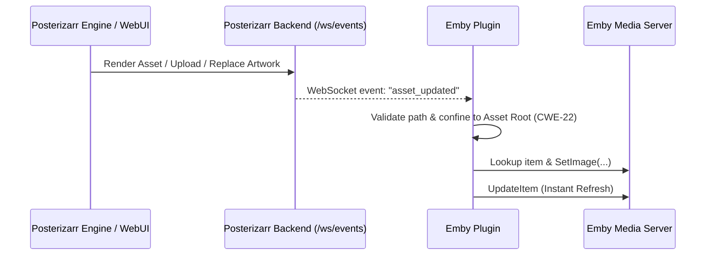

# Posterizarr Plugin for Emby

**Middleware for asset lookup. Maps local assets to library items as posters, backgrounds, or titlecards.**

!!! note "Port & Credits"
    This plugin is an Emby port of the original [Posterizarr Jellyfin Plugin](https://github.com/fscorrupt/posterizarr/tree/main/modules/Posterizarr.Plugin) by [fscorrupt](https://github.com/fscorrupt). All credit for the original idea, architecture, and implementation goes to him.

    This port was vibecoded using **Claude** (Anthropic).

## Overview

The Posterizarr Plugin acts as a local asset proxy for Emby. It is designed to work alongside the [Posterizarr](https://github.com/fscorrupt/posterizarr) automation script, allowing your media server to utilize locally generated or managed assets (posters, backgrounds, title cards) as metadata.

!!! tip "Middleware purpose"
    This middleware does not allow you to browse, search, or download assets.
    Its sole purpose is to replace the default artwork by mapping library items to your local file system.

## Features

*   **Local Asset Mapping:** Maps local files to library items without replacing original metadata permanently in some configurations.
*   **Metadata Provider:** Registers as a metadata provider for images.
*   **Support for Multiple Asset Types:** Handles Posters, Backgrounds, Seasons, and Title Cards.
*   **Real-Time WebSocket Sync:** Connects directly to Posterizarr's event stream. Automatically refreshes Emby library items immediately when artwork is created, edited, or overlay-processed in Posterizarr.
*   **Scheduled Sync Task:** Registers a background task to keep library images in sync with your local assets automatically on a customized schedule.

## Installation

!!! warning
    Only use this if you are not syncing from Plex, as it will overwrite your synced items with locally created assets from Posterizarr.

1.  Download the latest version of `Posterizarr.Plugin.Emby.dll` from the [GitHub Releases](https://github.com/fscorrupt/posterizarr/releases).
2.  Copy `Posterizarr.Plugin.Emby.dll` into your Emby Server's plugin directory:
    *   **Docker:** `/config/plugins/`
    *   **Windows:** `%appdata%\Emby-Server\programdata\plugins`
3.  **Restart** your Emby Server.

## Configuration

1. After restarting, go to **Dashboard** → **Plugins** → **Installed Plugins** and click **Posterizarr Emby**.
2. Click on **Settings**.
3. Configure your **Root Asset Folder Path** (the directory where your curated images are stored, e.g., `/assets`).
4. **Image Target Types:** Select which artwork types to automatically apply (Posters, Season Posters, Titlecards, Backdrops, Thumbnails).
5. **Real-Time Sync (WebSocket) Settings:**
    *   **Enable Real-Time Sync (WebSocket):** Check this box to enable instant updates.
    *   **Posterizarr URL:** Enter your Posterizarr server URL (e.g., `http://192.168.1.50:8000` or `http://localhost:8000`).
    *   **Posterizarr API Key (Required):** Enter your Posterizarr API key. The key is transmitted securely via the `X-API-Key` HTTP header and is mandatory for WebSocket authentication.
6. Click **Save**.
7. Go to your **Dashboard** → **Libraries**.
8. Manage a library (e.g., Movies).
9. Enable **Posterizarr** under the **Image Fetchers** settings.
10. Ensure it is prioritized according to your preferences.
11. Refresh metadata (**Search for missing metadata** → **Replace existing images**) for your library to pick up local assets for the first time.

## Real-Time Synchronization (WebSocket)

The Emby plugin includes a real-time event listener service (`PosterizarrWebSocketListener`) that connects directly to Posterizarr's `/ws/events` WebSocket endpoint.

### How It Works



1. **Instant Event Broadcast:** Whether artwork is generated during automated runs (Tautulli Recently Added, Sonarr/Radarr webhooks, manual runs, scheduled runs) or replaced in the WebUI, `LogsWatcher` detects the change and immediately broadcasts an `asset_updated` event over `/ws/events`.
2. **Direct Image Application:** Upon receiving the event, the Emby plugin directly opens the rendered file from disk and applies it to the library item via Emby's internal `SetImage` and `UpdateItem` APIs. The item refreshes in under a second without requiring a full library scan or waiting for scheduled tasks.
3. **Autonomous Operation:** Even if Posterizarr is configured with `UsePlex: true` and `UseJellyfin: false` / `UseEmby: false`, the Emby plugin operates autonomously by monitoring the shared `/assets` directory. When an asset is modified, Emby updates instantaneously without waiting for the daily scheduled task.
4. **Smart Cache Synchronization:** Once an item is updated via real-time sync, its hash is updated in the plugin's `SyncCacheManager`, ensuring scheduled tasks skip it without redundant re-processing.

### Security Highlights

* **Strict Header-Based Authentication:** The API key is **never** passed in the URL or query parameters. It is transmitted securely via the `X-API-Key` HTTP header during the WebSocket upgrade handshake, preventing accidental disclosure in web server access logs or proxy headers.
* **Path Traversal Protection (CWE-22):** All event paths are strictly sanitized against directory traversal sequences (`..`), invalid characters, and rooted paths, and are cryptographically verified to reside within the canonical `AssetFolderPath` root boundary before any file operation takes place.
* **DoS & Buffer Protections (CWE-400):** Incoming frames are enforced with maximum message limits (64 KB) to avoid memory exhaustion.

## Scheduled Tasks & Automation

The plugin registers a scheduled background task (default: daily at 02:00 AM) that automatically syncs and refreshes your libraries against local assets.

### Configuring the Sync Schedule

1. Open your Emby **Dashboard**.
2. In the left sidebar under the **Server** section, navigate to **Scheduled Tasks**.
3. Locate the **Posterizarr Sync Task** in the list.
4. Click on the task to customize its triggers:
    * You can configure the task to run on an interval, at a specific time of day (e.g., daily at 3:00 AM), on system startup, or on a weekly schedule.
5. You can also trigger the task manually at any time by clicking the **Play (Run)** button next to it.

## Building from Source

If you prefer to compile the plugin yourself from source code, run:

```bash
dotnet publish modules/Posterizarr.Plugin.Emby/Posterizarr.Plugin.Emby.csproj -c Release -o publish
```

The compiled `Posterizarr.Plugin.Emby.dll` will be located inside the `publish/` directory.
