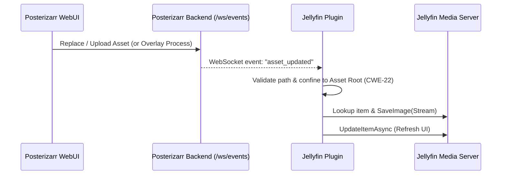

# Posterizarr Plugin for Jellyfin

**Middleware for asset lookup. Maps local assets to library items as posters, backgrounds, or titlecards.**

## Overview

The Posterizarr Plugin acts as a local asset proxy for Jellyfin. It is designed to work alongside the [Posterizarr](https://github.com/fscorrupt/posterizarr) automation script, allowing your media server to utilize locally generated or managed assets (posters, backgrounds, title cards) as metadata.

!!! tip "Middleware purpose"
    This middleware does not allow you to browse, search, or download assets.
    Its sole purpose is to replace the default artwork by mapping library items to your local file system.

## Features

*   **Local Asset Mapping:** Maps local files to library items without replacing original metadata permanently in some configurations.
*   **Metadata Provider:** Registers as a metadata provider for images.
*   **Support for Multiple Asset Types:** Handles Posters, Backgrounds, Seasons, and Title Cards.
*   **Real-Time WebSocket Sync:** Direct connection to Posterizarr's event stream. Automatically refreshes media items immediately when an asset is created or edited in Posterizarr, eliminating the need to wait for scheduled tasks.
*   **Scheduled Background Sync:** Automatically runs on a configurable schedule to keep artwork in sync.
*   **Version Compatibility:** Fully compatible with both **Jellyfin 10.11.x** (.NET 9) and **Jellyfin 12.0.x** (.NET 10). The repository manifest automatically serves the appropriate build for your server version.

## Installation

!!! warning
    Only use this if you are not syncing from Plex, as it will overwrite your synced items with locally created assets from Posterizarr.

### Via Repository (Recommended)

1.  Open your Jellyfin **Dashboard**.
2.  Navigate to **Plugins** -> **Repositories**.
3.  Click **Add** and enter the following information:
    *   **Repository Name:** Posterizarr
    *   **Repository URL:** `https://raw.githubusercontent.com/fscorrupt/posterizarr/main/manifest.json`
4.  Navigate to the **Catalog** tab.
5.  Find **Posterizarr** under the **Metadata** category.
6.  Click **Install** and choose the latest version.
7.  **Restart** your server.

## Configuration

1. After restarting, go to **Plugins** → **Installed Plugins** and click **Posterizarr**.
2. Click on **Settings**.
3. Configure your **Root Asset Folder Path** (the directory where your curated images are stored, e.g., `/assets`).
4. **Image Target Types:** Choose which artwork types to automatically apply (Posters, Season Posters, Titlecards, Backdrops, Thumbnails).
5. **Real-Time Sync (WebSocket) Settings:**
    *   **Enable Real-Time Sync (WebSocket):** Check this box to enable instant updates.
    *   **Posterizarr URL:** Enter the base URL of your Posterizarr server (e.g., `http://192.168.1.50:8000` or `http://localhost:8000`).
    *   **Posterizarr API Key (Optional):** If authentication is configured in Posterizarr, enter your API key here.
6. Click **Save Settings**.
7. Go to your **Dashboard** -> **Libraries**.
8. Manage a library (e.g., Movies).
9. Enable **Posterizarr** under the **Image Fetchers** settings.
10. Ensure it is prioritized according to your preferences.
11. Refresh metadata (Search for missing metadata → **Replace existing images**) for your library to pick up local assets for the first time.

## Real-Time Synchronization (WebSocket)

The plugin features a built-in background service (`PosterizarrWebSocketListener`) that connects directly to Posterizarr's `/ws/events` WebSocket endpoint.

### How It Works

1. **Instant Event Broadcast:** When an asset is saved or overlay-processed in Posterizarr WebUI, an `asset_updated` payload is immediately broadcast across active WebSocket connections.
2. **Autonomous Operation:** Even if Posterizarr is configured with `UsePlex: true` and `UseJellyfin: false`, the Jellyfin plugin operates autonomously by monitoring the shared `/assets` directory. When an asset is modified, Jellyfin updates instantaneously without running a full library scan.
3. **Smart Cache Synchronization:** Once an item is updated via real-time sync, its hash is recorded in the plugin's `SyncCacheManager`, ensuring future scheduled tasks skip it without redundant disk reads or CPU overhead.

### Security Highlights

* **Strict Header-Based Authentication:** The API key is **never** passed in the URL or query parameters. It is transmitted securely via the `X-API-Key` HTTP header during the WebSocket upgrade handshake, preventing accidental disclosure in web server access logs or proxy headers.
* **Path Traversal Protection (CWE-22):** All event paths are strictly sanitized against directory traversal sequences (`..`), invalid characters, and rooted paths, and are cryptographically verified to reside within the canonical `AssetFolderPath` root boundary before any file operation takes place.
* **DoS & Buffer Protections (CWE-400):** Incoming frames are enforced with maximum message limits (64 KB) to avoid memory exhaustion.
